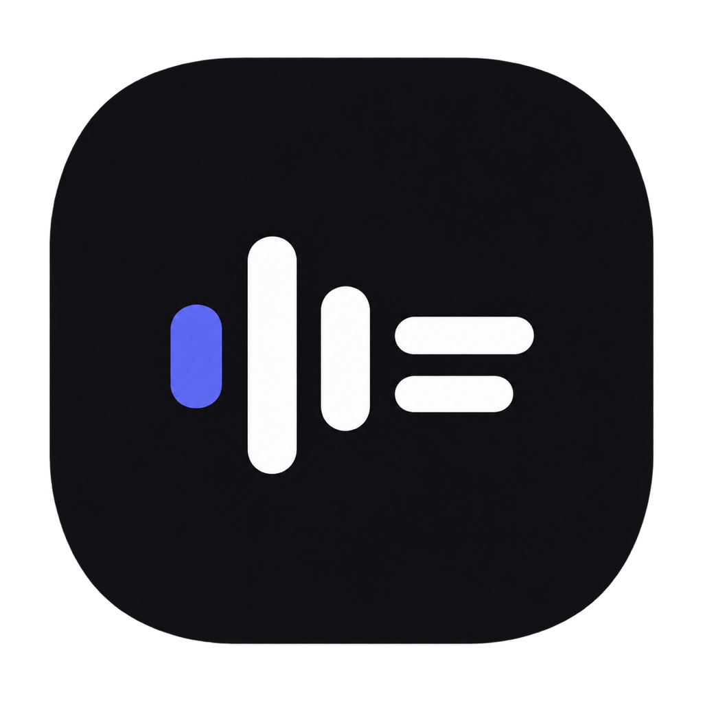

# Meeting Scribe

Transcreva áudios, vídeos e reuniões em um app nativo para macOS. Criado por [@junowoz](https://github.com/junowoz).

[Baixar para Mac](https://github.com/junowoz/meeting-scribe/releases/latest/download/MeetingScribe.dmg) · [Versões](https://github.com/junowoz/meeting-scribe/releases)



## Instalar

Requer macOS 14 ou superior, em Macs com Apple Silicon ou Intel.

1. Baixe o DMG e abra o arquivo.
2. Arraste MeetingScribe para Applications.
3. Abra o app na pasta Aplicativos.

Esta distribuição não usa Developer ID da Apple e não é notarizada. Na primeira abertura, o macOS pode bloquear o app. Depois de tentar abri-lo, acesse Ajustes do Sistema → Privacidade e Segurança → Abrir Mesmo Assim. Confira que o download veio deste repositório. Macs gerenciados podem impedir essa autorização. Não é necessário desativar o Gatekeeper.

## Começar

Abra Ajustes → Conta e cole sua API key da AssemblyAI. O botão Testar conexão verifica a chave. A transcrição usa o saldo da sua conta AssemblyAI.

Arraste um ou mais arquivos para a janela, ou use Importar arquivos (⌘O). Os arquivos entram em uma fila sequencial. M4A, MP3, MP4, OGG, FLAC, WAV, WebM e outros formatos documentados pela AssemblyAI são enviados no formato original, sem exigir FFmpeg. A compatibilidade final depende do conteúdo e do codec do arquivo.

Use Gravar para capturar o áudio interno do Mac e, opcionalmente, o microfone e a tela. Na primeira gravação, autorize Microfone e Gravação de Tela quando o macOS solicitar. Use fones para reduzir eco e obtenha o consentimento dos participantes.

## Biblioteca e exportação

Busque reuniões pelo título ou conteúdo. Abra a transcrição para buscar trechos, ajustar o tamanho do texto, copiar ou exportar. TXT, Markdown e PDF estão disponíveis para textos concluídos. SRT e VTT exigem marcações de tempo.

O botão Excluir pede confirmação e move a pasta local para o Lixo do Mac. O arquivo original importado não muda. Renomear e Mostrar arquivos no Finder ficam no menu Mais.

O resumo é opcional e depende do acesso da conta ao modelo de resumo da AssemblyAI. Uma falha no resumo não apaga a transcrição. É possível tentar gerar apenas o resumo novamente.

## Dados

A API key fica no Keychain do macOS. A mídia é enviada à AssemblyAI para processamento. Não há servidor próprio ou conta do Meeting Scribe.

O histórico e as exportações ficam em `~/Library/Application Support/MeetingScribe/`, ou na pasta Application Support do contêiner do app quando o macOS aplica o sandbox. Mostrar arquivos no Finder abre a localização efetiva. Preserve a pasta de dados ao migrar de Mac.

## Atualizações

O app usa Sparkle e verifica versões no GitHub. As atualizações são autenticadas com uma assinatura Ed25519 do projeto. Essa assinatura protege a atualização e não equivale à notarização Apple. Use Meeting Scribe → Buscar atualizações ou habilite a busca automática em Ajustes → Sobre.

## Desenvolvimento

Requer Xcode com Swift 6. O projeto usa Swift Package Manager e Sparkle como única dependência externa.

```bash
swift test
./script/build_and_run.sh --verify
```

O script compila, monta o bundle, assina localmente e abre o app. `--debug`, `--logs` e `--telemetry` também estão disponíveis.

## Publicar

O workflow Test and build executa os testes e monta o app em pushes para `main`/`master` e em pull requests. O workflow Publish DMG and updates testa, gera o DMG universal e publica os arquivos no GitHub Releases.

Configure o secret `SPARKLE_PRIVATE_KEY` no repositório com a chave correspondente a `SUPublicEDKey` em `Support/Info.plist`. Mantenha essa chave privada fora do Git e preserve uma cópia segura. Não gere outra chave para cada versão.

Para publicar, execute o workflow Publish DMG and updates com uma versão como `1.1.1`, ou envie uma tag:

```bash
git tag v1.1.1
git push origin v1.1.1
```

Para criar uma distribuição local assinada com a chave no Keychain:

```bash
VERSION=1.1.1 BUILD_NUMBER=111 ./script/release.sh
```

O resultado fica em `dist/release/`: DMG, appcast assinado e SHA256SUMS. O número de build deve aumentar a cada versão. A publicação recusa uma chave ausente; não há fallback para atualizações sem assinatura.
